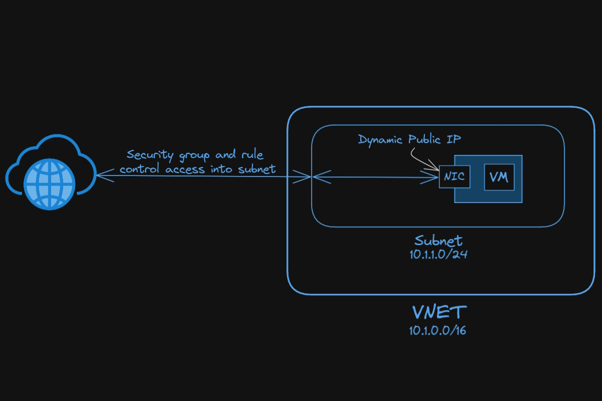

# Azure IaC Example

This repo represents an example of a mininal Azure Cloud configuration. 

## The Plan

1) I need to hook this up into CI/CD and holding state in Azure blob storage so that the `terraform apply` and `terraform destroy` commands can be run on GH Actions.
1) Once both commands can be run from Actions, finalize documentation 
1) Work on specific implementation

## Terraform 

*Vizualization of the minimal Azure configuration.*

## Ansible & Docker

This example has Terraform create a dynamic `hosts` file for Ansible to use. Ansible then installs Docker on the remote server, adds the Ansible user to the docker group, and uses `compose.yml` to deploy an `nginx` proxy to the server.
